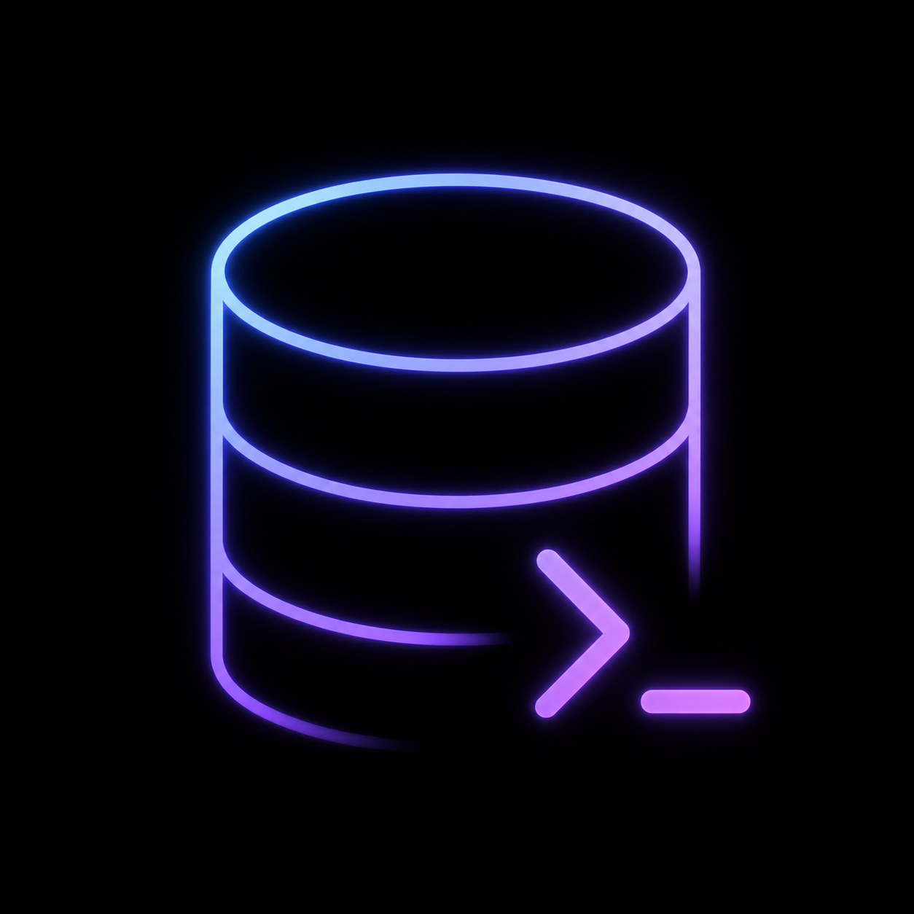

<div align="center">



# PowaDB

**A fast, modern desktop database client for PostgreSQL, MySQL, SQLite and MongoDB.**

Built with [Tauri 2](https://tauri.app), [React 19](https://react.dev) and [Rust](https://www.rust-lang.org).

[](https://github.com/MalikAza/powadb/releases/latest)
[](https://github.com/MalikAza/powadb/actions/workflows/checks.yml?query=branch%3Amain)


[Download](#download) · [Features](#features) · [Build from source](#build-from-source) · [Contributing](#contributing)

</div>

---

## Features

- 🔌 **Multi-engine** — PostgreSQL, MySQL and SQLite via [`sqlx`](https://github.com/launchbadge/sqlx), plus MongoDB via the official Rust driver. UI features are gated per-engine by a `Capabilities` descriptor, so each engine only exposes what it actually supports.
- 🍃 **MongoDB** — browse databases and collections, run queries in either a JSON form or a mongosh-style DSL (`db.collection.find({...}).sort({...}).limit(N)`) with context-aware completions, and edit documents inline.
- 🗄️ **Multiple databases per connection** — switch the active database from the command palette or the schema tree; create and drop databases inline.
- 🔐 **Tunneled connections** — connect through an **SSH** jump host or a **WireGuard** tunnel, with the tunnel managed transparently by the app.
- ✍️ **SQL editor** — CodeMirror 6 with syntax highlighting and schema-aware autocompletion.
- 📊 **Virtualized results grid** — TanStack Table + Virtual, fluid on millions of rows; multi-row select and bulk delete.
- 🛠️ **Inline DML editing** — primary-key-aware updates straight from the grid.
- 🔗 **Foreign-key navigation** — click a foreign-key cell to open the referenced row in a new browse tab.
- 🔍 **Cell preview** — open any cell in a full-value viewer for long text, JSON or other oversized payloads.
- 🧮 **BYTEA display modes** — render binary columns as Hex, UTF-8, UUID, ULID or Base64, with per-column overrides remembered across sessions.
- 🗂️ **Schema browser** — schemas, tables, columns and indexes at a glance, with full-text search.
- 🧬 **Schema diagram** — visualize tables and relations on an interactive diagram and export it to image.
- 🗺️ **Geometry / GIS visualization** — preview geometry columns on a real map (single cell, multi-row, or whole column), with a feature popover showing lat/long and row data on click.
- 🧭 **EXPLAIN view** — visualize query plans.
- 📦 **Dump &amp; restore** — export and import databases through `pg_dump` / `mysqldump` / `sqlite3` / `mongodump` (configurable binary paths), with progress reporting and cancellation.
- 📁 **Connection manager** — organize connections in folders, color-tag each one, export / import the whole set, optionally remember passwords.
- 🕓 **History & snippets** — recall past queries and save reusable SQL.
- ⌘ **Command palette** — quick navigation, database switching, connection close, all from the keyboard.
- 🎨 **Themes** — light / dark / system, plus drop-in custom themes via `.powadb-theme.json` files (Catppuccin, Dracula, Gruvbox, Nord, Solarized, Tokyo Night ship with the app).
- ⬆️ **Auto-update** — built-in, signed updates.

## Download

Grab the latest signed bundle for your OS from the [**Releases**](https://github.com/MalikAza/powadb/releases/latest) page:

| Platform | Bundle |
| :--- | :--- |
| macOS (Apple Silicon / Intel) | `.dmg` |
| Linux | `.AppImage` / `.deb` |
| Windows | `.msi` / `.exe` |

### macOS — first launch

The app is **not** signed with an Apple Developer ID, so Gatekeeper will quarantine it the first time you install from the DMG. Clear it once with either:

- **Finder** — right-click `PowaDB.app` in `/Applications` → **Open** → confirm. macOS remembers the choice.
- **Terminal** — `xattr -dr com.apple.quarantine /Applications/PowaDB.app`

Subsequent in-app updates don't trigger this prompt again — the Tauri updater downloads outside of Gatekeeper's web-download path.

## Upgrading from 0.10

The next release reworks how PowaDB stores secrets and how its local SQLite store is migrated. Two things you should know before you upgrade:

### 1. Saved passwords move to the OS keychain

Connection passwords are no longer stored in plaintext inside `powadb.db`. On first launch after upgrading, PowaDB walks every saved connection that still has a plaintext password and lifts it into the platform credential store:

| Platform | Backend |
| :--- | :--- |
| macOS | Keychain (service `com.aza.powadb`) |
| Windows | Credential Manager |
| Linux | libsecret / secret-service |

**On macOS,** the first time the app reads any saved password (typically the first time you click a connection after upgrading), the OS shows a Keychain prompt asking whether to allow `PowaDB` to access `com.aza.powadb`. **Click "Always Allow."** If you only click "Allow," you'll get the same prompt on every subsequent connect.

If you ever want to inspect or revoke the stored credentials, open **Keychain Access** and search for `com.aza.powadb` — each saved connection appears as an entry with account `connection-<uuid>`.

#### Fallback (CI / headless Linux / locked Keychain)

If the keychain backend isn't reachable, PowaDB falls back to the legacy `password` column in `powadb.db` and prints a loud warning to stderr. The app keeps working, but credentials are again stored in plaintext — see the warning for guidance on installing a keychain backend.

### 2. Pre-migration backup of `powadb.db`

The first time a newly-installed version opens your `powadb.db`, **PowaDB copies the file to `powadb.db.backup-pre-<version>`** alongside it — before any schema or password migration runs. One backup is created per version you upgrade *to*; subsequent launches on the same version are no-ops.

If a release ever breaks your local store, you can roll back: install the older PowaDB binary, replace `powadb.db` with the backup, and you're back to the pre-upgrade state.

#### Where the files live

| OS | Path |
| :--- | :--- |
| macOS | `~/Library/Application Support/com.aza.powadb/powadb.db` (and `…/powadb.db.backup-pre-<version>`) |
| Linux | `~/.local/share/com.aza.powadb/powadb.db` |
| Windows | `%APPDATA%\com.aza.powadb\powadb.db` |

#### Rolling back

1. **Quit** PowaDB.
2. Move the current `powadb.db` aside (don't delete it — you may want it for diagnostics):
   ```bash
   mv ~/Library/Application\ Support/com.aza.powadb/powadb.db \
      ~/Library/Application\ Support/com.aza.powadb/powadb.db.broken
   ```
3. Copy the backup back into place:
   ```bash
   cp ~/Library/Application\ Support/com.aza.powadb/powadb.db.backup-pre-<version> \
      ~/Library/Application\ Support/com.aza.powadb/powadb.db
   ```
4. Reinstall the previous PowaDB version from the [Releases](https://github.com/MalikAza/powadb/releases) page.
5. **Optional cleanup:** if the upgrade had already migrated passwords into your keychain, those entries stay behind. Open **Keychain Access**, search `com.aza.powadb`, and delete any `connection-<uuid>` entries you don't want lingering.

The backup files are safe to delete once you're confident the upgrade is stable — they're just a one-time safety net.

## Build from source

### Prerequisites

- [Node.js](https://nodejs.org/) 20+ and npm (pnpm works too)
- [Rust](https://rustup.rs/) stable toolchain
- Tauri system dependencies — see the [Tauri prerequisites guide](https://tauri.app/start/prerequisites/)

### Run in dev

```bash
npm install
npm run tauri:dev     # full desktop app
npm run dev           # frontend only at http://localhost:1420 (no IPC)
```

### Build a release

```bash
npm run tauri:build
```

Artifacts land in `src-tauri/target/release/bundle/`.

### Quality checks

```bash
npm run check             # typecheck + biome lint
npm run lint:fix          # auto-fix biome issues
npm run validate:themes   # validate bundled theme files against the schema
cd src-tauri && cargo clippy -- -D warnings && cargo fmt --check
```

### Tests

```bash
npm test                       # vitest (frontend)
npm run test:coverage          # writes ./coverage/lcov.info
cd src-tauri && cargo test --lib   # backend
```

Tests live next to the code they cover: `src/**/*.test.ts(x)` for the frontend (Vitest + jsdom) and `#[cfg(test)] mod tests` blocks inside each Rust file. CI runs both suites and uploads coverage to [Codecov](https://about.codecov.io/) under the `frontend` and `backend` flags.

## Architecture at a glance

PowaDB is a single Tauri 2 app — React 19 / TypeScript frontend in `src/`, Rust backend in `src-tauri/`. The two halves communicate **only** through typed IPC wrappers in `src/ipc/index.ts`.

```
src/                       React app
  components/              UI (editor, results grid, diagram, geometry map, panels, dialogs)
  stores/                  Zustand stores (connections, tabs, schema, …)
  ipc/index.ts             Typed wrappers for every Tauri command
src-tauri/src/
  commands/                Tauri command handlers (query, schema, dump, diagram, geo, …)
  engine/                  Engine trait + per-backend impls (Postgres / MySQL / SQLite / MongoDB) and capabilities
  drivers/                 Postgres / MySQL / SQLite execution + value coercion
  ssh/                     SSH tunnel manager
  wireguard/               WireGuard tunnel manager
  pool_registry.rs         Live sqlx pool cache + query cancellation
  storage.rs               Local SQLite store (connections, history, snippets, settings)
```

For a deeper tour — IPC contract, the four `AppState` sub-systems, cancellation patterns — see [`CLAUDE.md`](./CLAUDE.md).

## Contributing

Contributions are welcome — bug reports, feature requests and pull requests.

1. **Fork** the repository and clone your fork.
2. **Create a branch** off `main` (`feature/...` or `bug/...`).
3. **Make your changes** and run the quality checks above, including `npm test` and `cargo test --lib`. PRs adding new behavior are expected to add tests alongside the change where it makes sense.
4. **Open a pull request** describing the change and the motivation.

A few non-obvious conventions worth knowing before you patch:

- Frontend never calls `invoke()` directly — every IPC goes through a typed wrapper in `src/ipc/index.ts`.
- shadcn/ui components under `src/components/ui/` are vendored and excluded from biome — leave them alone.
- TypeScript is strict with `noUnusedLocals` / `noUnusedParameters` — unused identifiers fail the build.
- See [`CLAUDE.md`](./CLAUDE.md) for the full architecture and conventions.

## Tech stack

- **Frontend** — React 19, TypeScript, Vite, Tailwind CSS 4, Radix UI / shadcn, Zustand, React Hook Form + Zod, CodeMirror 6, TanStack Table + Virtual
- **Backend** — Rust, Tauri 2, `sqlx` (Postgres / MySQL / SQLite), `mongodb` (MongoDB), Tokio
- **Local storage** — SQLite at `<app_data_dir>/powadb.db` for connections, folders, query history, snippets, settings

## Releasing

<details>
<summary><b>Maintainer-only</b> — how releases are cut and how the auto-updater is wired.</summary>

<br>

Releases are built and published automatically by `.github/workflows/release.yml` when a `v*` tag is pushed.

```bash
./scripts/bump-version.sh 0.3.1
git add -A && git commit -m "chore: release v0.3.1"
git push
git tag v0.3.1 && git push origin v0.3.1
```

### Required secrets

- `TAURI_SIGNING_PRIVATE_KEY` — full contents of `~/.tauri/powadb.key`. Do **not** set `TAURI_SIGNING_PRIVATE_KEY_PASSWORD` for a passwordless key (GitHub secrets cannot hold empty values, and any non-empty value — including a space — fails to decrypt).

The repo's default workflow permissions must be **Read and write** (Settings → Actions → General → Workflow permissions) so the release job can create releases.

### How auto-update works

The release workflow:

1. Builds and signs bundles for macOS / Linux / Windows.
2. Creates a GitHub Release with the binaries + a `latest.json` manifest.

The installed app polls `https://github.com/MalikAza/powadb/releases/latest/download/latest.json` anonymously (the repo is public, so no PAT is needed). It checks on launch, every 30 minutes, and on demand from Settings. On match, it downloads the signed bundle, verifies the minisign signature and offers to restart.

</details>
